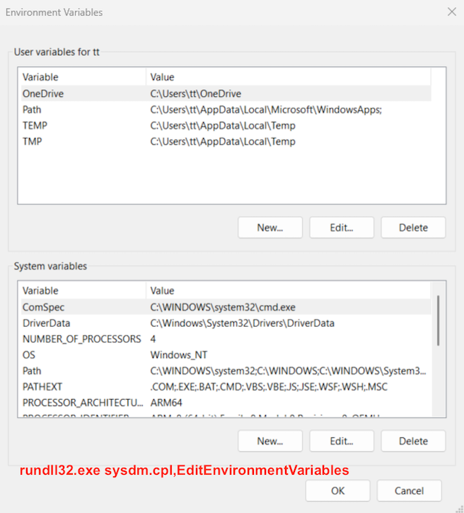

appwiz.cpl

cleanmgr

desk.cpl

devmgmt.msc

dxdiag

eventvwr.msc

firewall.cpl

fsmgmt.msc

inetcpl.cpl

intl.cpl

lusrmgr.msc

main.cpl

mmsys.cpl

ncpa.cpl

powercfg.cpl

secpol.msc

sysdm.cpl

rundll32.exe sysdm.cpl,EditEnvironmentVariables

wscui.cpl

